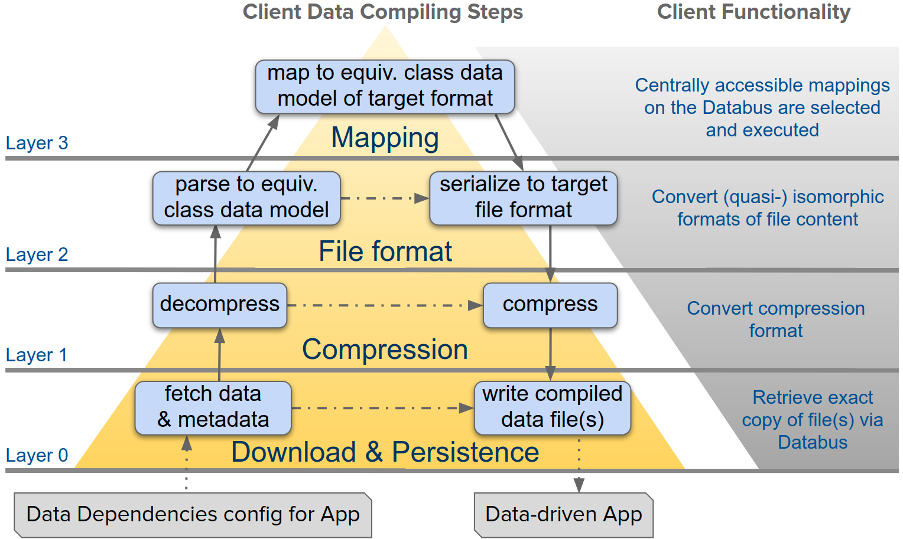

# Concept

<figure><figcaption>
data flow of DBpedia's Databus Client 
</figcaption></figure>

**Download-Layer:** This layer downloads data assets from the DBpedia Databus, preserving their provenance through stable file identifiers and additional metadata. It allows fine-grained selection of data assets through an interoperable data dependency specification and compiling configurations.

**Compression-Layer:** If conversion is needed, this layer detects the input compression format, decompresses the file, and passes it to the Format-Layer if necessary. It then compresses the converted file into the desired output compression format and returns it to the Download-Layer.

**File-Format-Layer:** This layer handles data format conversion, utilizing the Format-Layer and Mapping-Layer as required. It parses the uncompressed file into a unified internal data structure for the corresponding format equivalence class. The Format-Layer serializes this data structure into the desired output format and sends it back to the Compression-Layer.

**Mapping-Layer:** Used when the input and output formats belong to different equivalence classes or require data manipulation. Mapping configurations are used to transform the data from the input equivalence class to the internal data structure of the target format. The transformed data is then passed back to the Format-Layer.

The Compression-Layer, File-Format-Layer, and Mapping-Layer collectively represent the transformation phase of the ETL (Extract-Transform-Load) process. The Databus Client's modular design enables efficient data processing, conversion, and manipulation, enhancing reusability and flexibility in data management.
